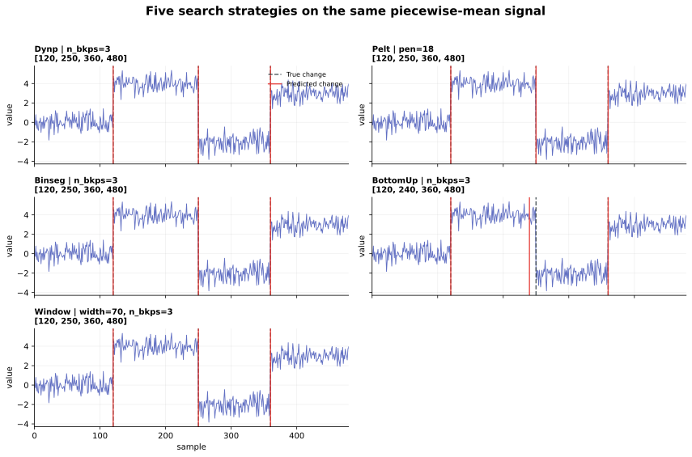

<div class="rustures-hero" markdown>

# Change-point detection with a Rust core

Fast, memory-aware offline change-point detection for Python. Rustures combines
familiar `fit` / `predict` APIs with exact dynamic programming, kernel methods,
robust costs, and endpoint-batched custom Python costs.

[Get started](getting-started.md){ .md-button .md-button--primary }
[Explore custom costs](custom-costs.md){ .md-button }
[View on GitHub](https://github.com/denrew88/rustures){ .md-button }

</div>

!!! warning "Alpha software"

    Rustures is usable and extensively tested, but its public API and compatibility
    guarantees may still change between releases. Pin the version in production and
    validate results on representative data.

## A small Python API, a native execution core

```python
import rustures as rpt

signal, truth = rpt.pw_constant(
    n_samples=600,
    n_features=2,
    n_bkps=3,
    noise_std=0.7,
    seed=42,
)

prediction = rpt.Pelt(
    model="l2",
    min_size=10,
    jump=1,
).fit_predict(signal, pen=12.0)

precision, recall = rpt.precision_recall(truth, prediction, margin=10)
print(prediction, precision, recall)
```

Rustures uses half-open segments. A result of `[120, 360, 600]` means the three
segments `[0, 120)`, `[120, 360)`, and `[360, 600)`. The terminal sample count is
always included in the returned breakpoint list.

## See the detectors work

{ .rustures-figure }

The dashed lines are the known changes and the red lines are Rustures predictions.
The [visual tutorials](tutorials.md) show the exact outputs, runnable code, kernel
comparisons, and a robust example with injected outliers.

<div class="rustures-stat-grid" markdown>

<div class="rustures-stat" markdown>
**7 detectors**
Exact, penalized, kernel, greedy, and L1-Potts search.
</div>

<div class="rustures-stat" markdown>
**8 cost models**
Mean, median, rank, Gaussian, regression, AR, trend, and metric scatter.
</div>

<div class="rustures-stat" markdown>
**3 kernels**
Linear, RBF, and cosine with three exact storage backends.
</div>

<div class="rustures-stat" markdown>
**Python 3.10+**
Stable-ABI wheels for supported desktop and Linux targets.
</div>

</div>

## Why Rustures?

### Native hot paths

Built-in costs and search algorithms execute in optimized Rust. Long native
predictions release the Python GIL after Rustures has taken ownership of the state
needed for safe execution.

### Explicit memory policy

Dynp estimates its prediction workspace before allocation. Full-Gram kernel search
also has a configurable memory limit, while fused and streaming backends avoid
mandatory quadratic Gram storage.

### Exact kernel choices without one fixed storage strategy

Choose linear, RBF, or cosine kernels. The default fused backend is designed for
fixed-`K` throughput without materializing a full Gram matrix; full and streaming
backends provide different query and memory trade-offs.

### Endpoint-batched custom costs

Rustures extends the usual scalar custom-cost interface with an optional pairwise
batch callback:

```python
def error_many(starts, ends):
    # result[i] == error(starts[i], ends[i])
    ...
```

Dynp and Pelt collect candidates that share one endpoint and cross the Python/Rust
boundary once for the whole batch. This enables NumPy broadcasting without caching
an entire quadratic cost table. See [Custom Python costs](custom-costs.md).

### Catchable failures

Invalid inputs, memory preflight failures, numerical errors, callback exceptions,
and unwinding Rust panics are converted to Python exceptions. Abort-class failures
such as operating-system termination remain outside that guarantee.

## Choose a starting point

| What you know | Start with | Search objective |
|---|---|---|
| Number of changes `K` | [`Dynp`](algorithms.md#dynp) | Exact fixed-`K` partition |
| Penalty per change | [`Pelt`](algorithms.md#pelt) | Exact penalized partition on the selected grid |
| Changes may be nonlinear | [`KernelCPD`](algorithms.md#kernelcpd) | Kernelized fixed-`K` or penalized partition |
| You want a quick exploratory result | [`Binseg`](algorithms.md#binseg) | Recursive splitting |
| You prefer adjacent merging | [`BottomUp`](algorithms.md#bottomup) | Agglomerative merging |
| You want a local discrepancy scan | [`Window`](algorithms.md#window) | Deterministic peak selection |
| A scalar signal needs robust total variation | [`L1Potts`](algorithms.md#l1potts) | Penalized weighted L1-Potts objective |

## Project relationship to ruptures

Rustures is inspired by the excellent
[`ruptures`](https://github.com/deepcharles/ruptures) ecosystem and follows its
familiar workflow where practical. It is an independent implementation, not a
complete drop-in replacement. Compatibility differences are documented rather
than silently hidden.

## Next steps

- [Install Rustures and run your first detector](getting-started.md)
- [Choose an algorithm](algorithms.md)
- [Understand the built-in cost functions](costs.md)
- [Implement a vectorized custom cost](custom-costs.md)
- [Review the Python API](api-reference.md)
- [Read performance results and methodology](performance.md)
- [Check current limitations](limitations.md)
