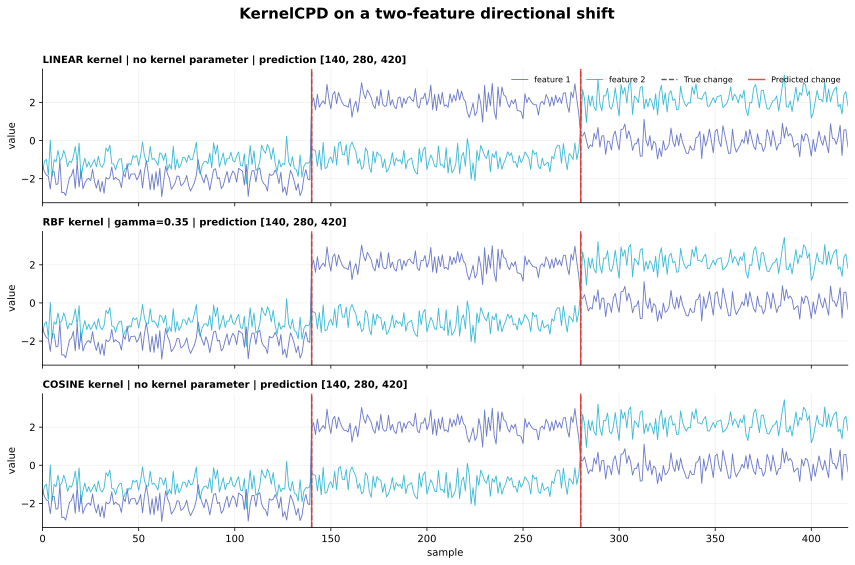
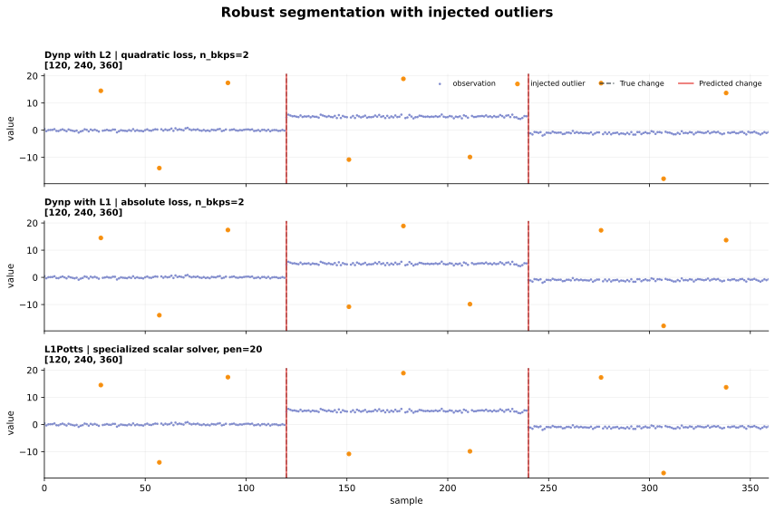

# Visual tutorials

These examples run the current Rustures wheel on deterministic synthetic signals.
The dark dashed lines are the known changes used to generate each signal; the red
lines are the changes predicted by Rustures. Returned breakpoint lists also contain
the terminal sample, even though it is not drawn as a change.

!!! note "Examples, not benchmarks"

    Parameters were selected to make each algorithm's behavior easy to inspect.
    These figures demonstrate API use and output semantics; see
    [Performance](performance.md) for controlled timing measurements.

## One signal, five search strategies

{ .rustures-figure }

The signal has four constant-mean regions and true breakpoints
`[120, 250, 360, 480]`. The five detectors share the same L2 segment cost, but they
search for a partition differently.

| Detector | Stopping rule | Prediction |
|---|---|---|
| `Dynp` | exactly 3 changes | `[120, 250, 360, 480]` |
| `Pelt` | penalty `18.0` per change | `[120, 250, 360, 480]` |
| `Binseg` | exactly 3 changes | `[120, 250, 360, 480]` |
| `BottomUp` | merge until 3 changes remain | `[120, 240, 360, 480]` |
| `Window` | select 3 local discrepancy peaks | `[120, 250, 360, 480]` |

`Dynp` evaluates the fixed-number objective exactly on the candidate grid. `Pelt`
instead lets a penalty decide how many changes are worth keeping. The other three
are approximate search strategies. On this particular signal, BottomUp places one
change at sample 240 rather than 250 because its early local merges constrain the
later answer. That visible difference is useful: sharing a cost does not make the
search algorithms equivalent.

```python
import rustures as rpt

dynp = rpt.Dynp(model="l2", min_size=20, jump=2)
pelt = rpt.Pelt(model="l2", min_size=20, jump=2)

fixed_k = dynp.fit_predict(signal, n_bkps=3)
penalized = pelt.fit_predict(signal, pen=18.0)
```

## Three views of the same two-feature signal

{ .rustures-figure }

Here every observation has two features. The underlying two-dimensional center
changes at samples 140 and 280. Each feature contributes to the kernel similarity;
KernelCPD does not segment the feature columns independently.

| Kernel | Parameters | Prediction |
|---|---|---|
| Linear | fused backend | `[140, 280, 420]` |
| RBF | fused backend, `gamma=0.35` | `[140, 280, 420]` |
| Cosine | fused backend | `[140, 280, 420]` |

All three kernels recover these deliberately clear center shifts. This does not mean
the kernels are interchangeable. Linear similarity emphasizes changes in ordinary
feature space, RBF similarity can expose nonlinear distribution changes, and cosine
similarity emphasizes direction while reducing sensitivity to magnitude. See
[Costs and kernels](costs.md) for the objective behind these choices.

```python
prediction = rpt.KernelCPD(
    kernel="rbf",
    gamma=0.35,
    backend="fused",
    min_size=20,
    jump=2,
).fit_predict(signal_2d, n_bkps=2)
```

## Outliers and robust objectives

{ .rustures-figure }

The orange points are nine deliberately injected outliers. The known piecewise
median changes at samples 120 and 240.

| Method | Objective | Prediction |
|---|---|---|
| `Dynp(model="l2")` | fixed 2 changes, squared deviations | `[120, 240, 360]` |
| `Dynp(model="l1")` | fixed 2 changes, absolute deviations | `[120, 240, 360]` |
| `L1Potts` | penalized scalar L1-Potts, `pen=20.0` | `[120, 240, 360]` |

All three succeed on this sample, but for different reasons. L2 fits a mean and
squares residuals, so a large outlier has disproportionate influence. L1 fits a
median and grows only linearly with the residual size. `L1Potts` combines that
robust scalar loss with its own specialized penalized solver, whereas Dynp solves a
general fixed-number partition problem. A single successful plot is not a
robustness guarantee; it makes the different objectives concrete.

```python
fixed_two = rpt.Dynp(model="l1", min_size=20).fit_predict(
    scalar_signal,
    n_bkps=2,
)
automatic_count = rpt.L1Potts().fit_predict(scalar_signal, pen=20.0)
```

## Reproduce every figure

The charts are generated by the committed
[figure-generation script](https://github.com/denrew88/rustures/blob/main/scripts/generate_docs_figures.py),
not hand-edited. Install a release wheel plus NumPy and Matplotlib, then run:

```bash
python -m pip install rustures numpy matplotlib
python scripts/generate_docs_figures.py
```

The exact seeds, parameters, and returned lists are also stored in
[machine-readable result metadata](assets/examples/results.json). Generated SVGs
are committed so GitHub Pages does not need to compile Rustures or install
Matplotlib.

## Complete notebooks

The repository also contains two executable Jupyter tutorials:

- [English tutorial](https://github.com/denrew88/rustures/blob/main/examples/rustures_tutorial_en.ipynb)
- [Korean tutorial](https://github.com/denrew88/rustures/blob/main/examples/rustures_tutorial_ko.ipynb)

GitHub renders both notebooks in the browser. To execute one locally, clone the
repository and install Jupyter with Rustures.

```bash
git clone https://github.com/denrew88/rustures.git
cd rustures

python -m venv .venv
python -m pip install --upgrade pip
python -m pip install rustures jupyter matplotlib
python -m jupyter lab
```

Activate `.venv` first if your shell does not automatically use it.

## More minimal recipes

### Fixed number of mean changes

```python
signal, truth = rpt.pw_constant(
    n_samples=500,
    n_features=2,
    n_bkps=3,
    noise_std=0.5,
    seed=42,
)

prediction = rpt.Dynp(model="l2", min_size=10, jump=1).fit_predict(
    signal,
    n_bkps=3,
)
```

### Unknown number of changes

```python
prediction = rpt.Pelt(model="l2", min_size=10, jump=1).fit_predict(
    signal,
    pen=12.0,
)
```

### Custom Bernoulli likelihood

See [Custom Python costs](custom-costs.md) for the full protocol and a vectorized
implementation pattern. The same approach works for Poisson counts, categorical
likelihoods, weighted domain losses, and other additive interval objectives.

## Reproducible synthetic data

Rustures includes deterministic generators:

```python
rpt.pw_constant(...)
rpt.pw_linear(...)
rpt.pw_normal(...)
rpt.pw_wavy(...)
```

Every generator returns `(signal, breakpoints)` and accepts an explicit seed. A seed
is reproducible within a Rustures version; generated streams may change across
versions when the implementation is optimized.
